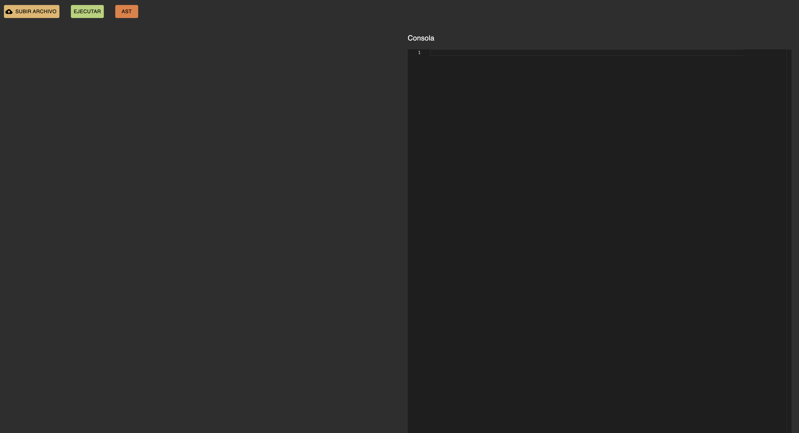
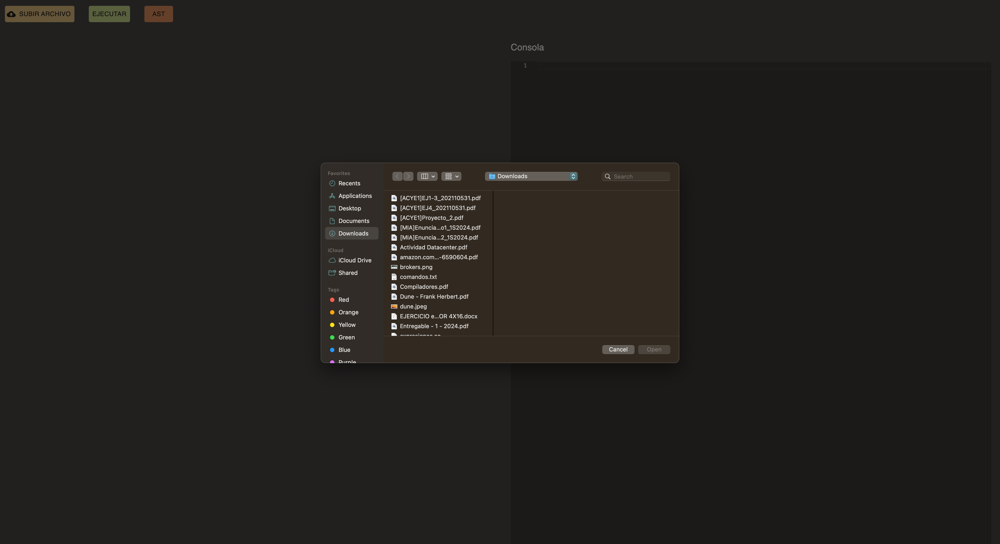
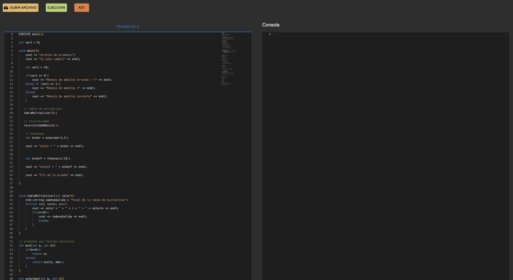
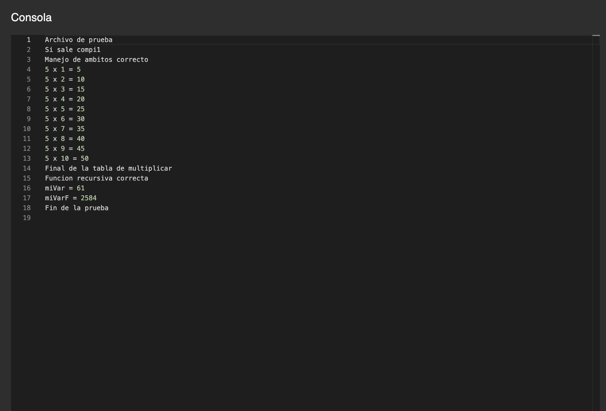
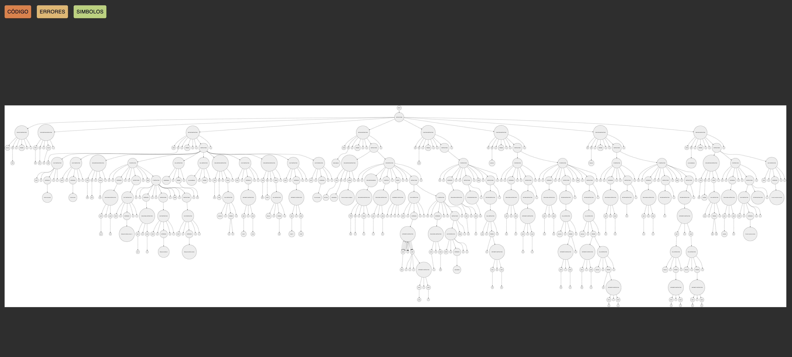

# MANUAL DE USUARIO
La aplicación web consta de 2 ventanas:
1. Home
2. Ast

## Home
En esta ventana es donde tenemos nuestra consola y editor de codigo.

En un principio veremos unicamente la ventana con la consola, después de presionar el botón de subir archivo, el programa comenzara a cargar y mostrara el editor. A continuación se detalla el proceso de como subir un documento:

1. Dar click en el botón `SUBIR ARCHIVO`
2. Se desplegara un menu, en el cuál hay que seleccionar el archivo que se desea utilizar

3. Se visualizara de la siguiente manera:

4. Dar clik en ejecutar
5. Se vera el resultado en la consola:

## Ast
Para visualizar el ast, se debe dar click en el botón **anarajado**, y esto nos llevara a una nueva vista. En donde se vera el ast generado.
